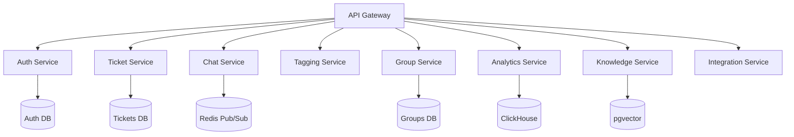

# SupportHub - Система техподдержки учреждений


**SupportHub** - это современная система управления обращениями для учреждений с динамической маршрутизацией, real-time коммуникацией и аналитикой производительности. Разработана для обработки 50 000+ обращений в месяц от 7 000+ учреждений с распределением по группам операторов.

## 🚀 Ключевые особенности

- **Динамическая маршрутизация** обращений по тегам и группам
- **Real-time чат** с историей сообщений и уведомлениями
- **Иерархическое управление** операторами (агент → менеджер → администратор)
- **Аналитика эффективности** в реальном времени
- **Интеграция с LLM** для автоматизации ответов
- **Гибкая модульная архитектура** (микросервисы)

## ⚙️ Технологический стек

### Бэкенд


### Базы данных


### Фронтенд


### Инфраструктура


## 📐 Архитектура системы



## 🧩 Функциональные модули

| Модуль | Описание | Статус |
|--------|----------|--------|
| **Auth Core** | Управление пользователями и доступом | ✅ Готов |
| **Ticket Engine** | Жизненный цикл обращений | ✅ Готов |
| **Chat Hub** | Real-time коммуникации | ✅ Готов |
| **Tagging System** | Категоризация и тегирование | 🚧 В разработке |
| **Operator Matrix** | Управление группами операторов | 🚧 В разработке |
| **Insight Core** | Аналитика производительности | 📅 Планируется |
| **Knowledge Base** | База знаний + AI-интеграция | 📅 Планируется |

## 🚀 Быстрый старт

### Предварительные условия
- Node.js 20+
- PostgreSQL 16
- Redis 7
- Docker 24+

### Установка
```bash
# Клонировать репозиторий
git clone https://github.com/your-org/supporthub.git
cd supporthub

# Установить зависимости
npm install

# Настроить окружение
cp .env.example .env

# Запустить в режиме разработки
npm run dev
```

### Демо-режим
```bash
# Запуск с SQLite и тестовыми данными
npm run demo
```

## 🌐 Развертывание

### Docker Compose
```bash
docker-compose -f docker-compose.prod.yml up -d
```

### Kubernetes
```bash
kubectl apply -f k8s/deployment/
```

### Инфраструктура как код (Terraform)
```bash
cd terraform/
terraform init
terraform apply
```

## 📚 Документация API

Доступ к Swagger UI: `http://localhost:3000/docs`

[](docs/openapi-spec.yaml)

## 🧪 Тестирование

```bash
# Запуск юнит-тестов
npm test

# Запуск интеграционных тестов
npm run test:integration

# Нагрузочное тестирование
npm run test:load
```
## 📜 Лицензия

Этот проект лицензирован под MIT License - подробности см. в файле [LICENSE](LICENSE).
